# 1. Introduction

## 1.1. 术语

* ITIL - Information Technology Infrastructure Library
* ITSM - Information Technology Service Management

## 1.2. ITIL v4 核心

关键点：

* 用户体验（Customer Experience）
* 价值流（Value Streams）
* 数字化转型（Digital Transformation）

ITIL v4的核心

* 服务价值系统（SVS - Service Value System），核心组件如：
    * 价值链（ITIL Service Value Chain）
    * 实践（ITIL Practices）
    * 指导原则（ITIL Guiding Principles）
    * 统治/治理方式（Governance）
    * 持续改进（Continual Improvement）

    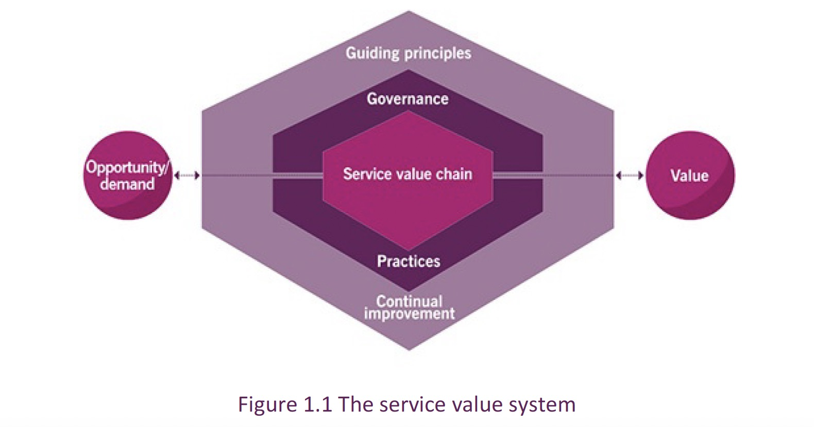

*  四个维度的模型（Four Dimensions Model）
    * 组织人事管理（Organizations and People）
    * 信息技术（Information and Technology）
    * 合作伙伴和供应商（Partners and Suppliers）
    * 价值流和过程（Value Streams and Processess）

# 2. 服务管理 Service Management

* 价值本质和价值共同创造（Nature of value / Value co-creation）
* 组织、服务提供者、服务消费者、其他利益相关者
Organizations, Service Providers, Service Consumers, Other Stakeholders：
* 产品和服务（Products and Services）
* 服务关系（Service Relationships）
* 输出、成本、风险（Value：outcomes, costs, risks）

服务管理：一种**专有组织能力**，以服务的形式为客户提供价值。

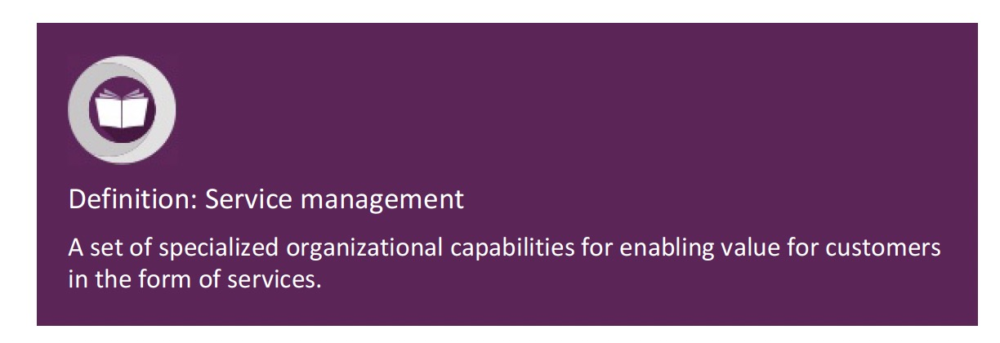

*Service Management: A Set of specialized organizational capabilities for enabling value for customers in the form of services.*

**专有组织能力**包括：

* 价值本质（Nature of Value）
* 利益相关方的性质和范围（Nature of Scope of Stakeholders）
* 如何通过服务实现创造价值

## 2.1. 价值/共创价值

价值：对某种事物感知到的**好处、用途、重要性**（价值是主观的）。

*Value: The perceived benefits, usefulness, and importance of something.*

## 2.2. 组织、服务提供者、服务消费者、利益相关者

### 2.2.1. 组织

组织：有自己职责、权力和关系来实现目标的一个或一群人。

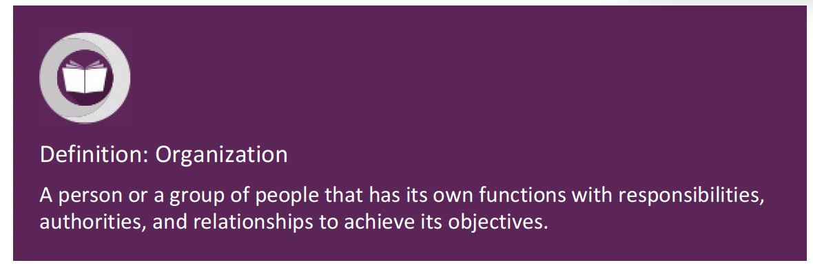

*A person or a group of people that has its own functions with responsibilities, authorities, and relationships to achieve its objectives.*

### 2.2.2. 服务提供者

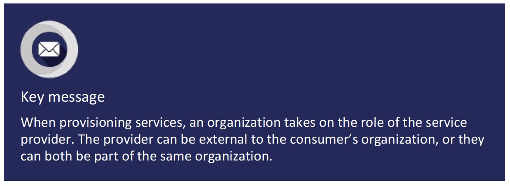

* 传统视角：服务提供者一般是企业内的IT部门，其他部门和单元则是消费者。
* 现代视角：服务提供者可以针对其他市场、业务、独立消费者单独推销服务，消费者不局限于企业内。

### 2.2.3. 服务消费者

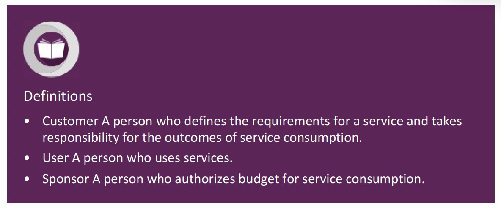

* 客户（Customer）：谁定义服务消费端的服务需求、任务职责。
* 用户（User）：谁使用了该服务。
* 发起者（Sponsor）：谁授权服务消费的预算。

### 2.2.4. 相关利益者

ITIL v4中服务管理主要关注点，不同利益者输出价值和输入价值有所区别。参考下表（示例）：

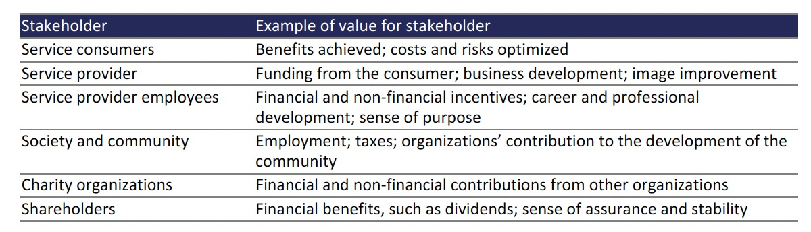

## 2.3. 产品和服务

### 2.3.1. 资源配置

服务管理的**中心组件**：

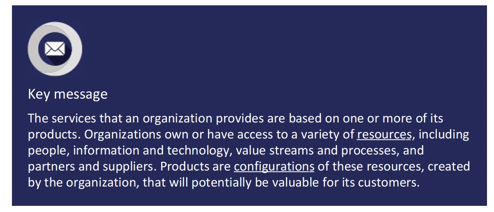

* 服务（Services）：一种客户想要的通过促成成果落地的价值共创手段，客户不用关心管理成本和风险。
* 产品（Products）：一个组织内部设计的资源的配置。

### 2.3.2. 服务产品

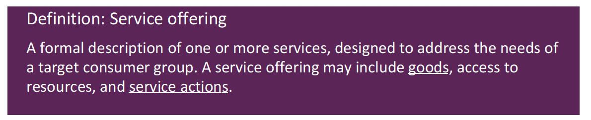

*Service Offering: A formal description of one or more services, designed to address the needs of a target consumer group. A service offering may include goods, access to resources, and service actions.*

服务产品包括：

* 卖给客户的商品（Goods）。
* 在协议条款条件范围内授权给消费端使用的资源（Access to Resources）。
* 满足消费者需求执行的服务操作（Service Actions）。

## 2.4. 服务关系

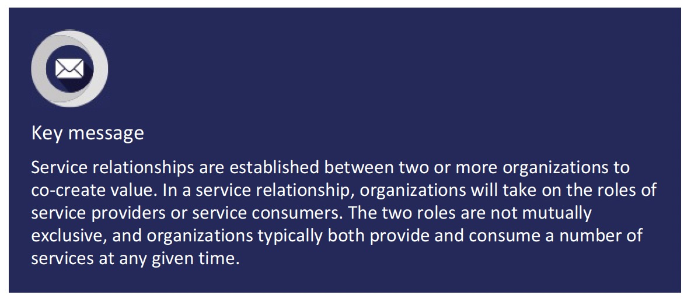

### 2.4.1. 服务关系模型

服务提供者交付服务时，它们会：

* 为服务消费者创建一个新的服务。
* 为服务消费者更改一个已经存在的服务。

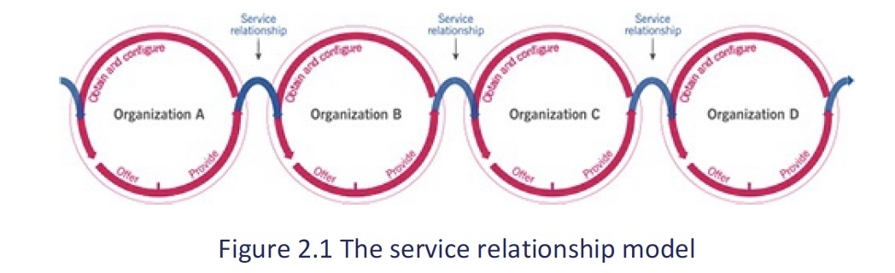

**服务消费者**可以使用新的或更改过的资源创建自己的产品，或针对另外的客户提供相关服务，由此可转换成**服务提供者**。

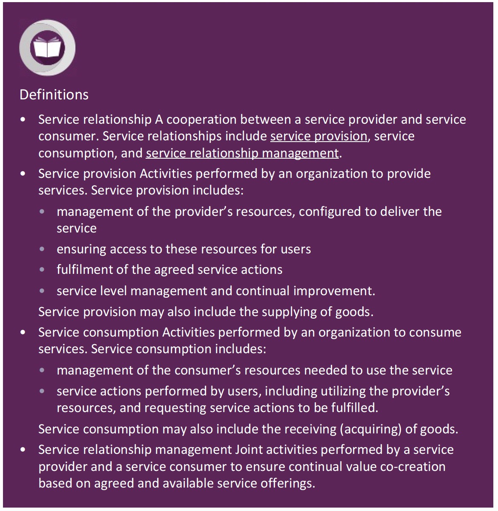

关系模型包含三部分：

* 服务条款（Service Provision）
* 服务消费（Service Consumption）
* 服务关系管理（Service Relationship Management）

## 2.5. 价值：输出、成本、风险

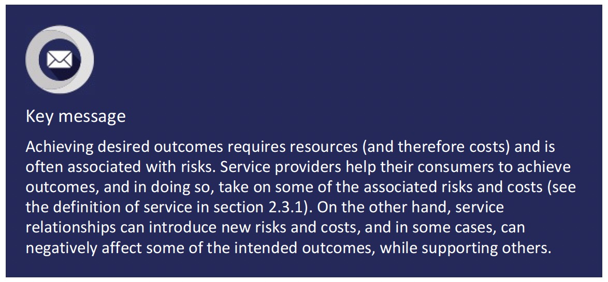

